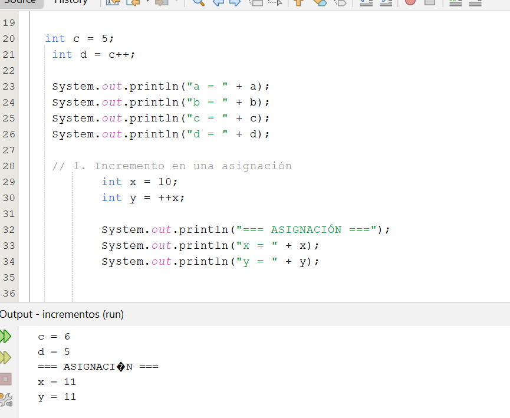
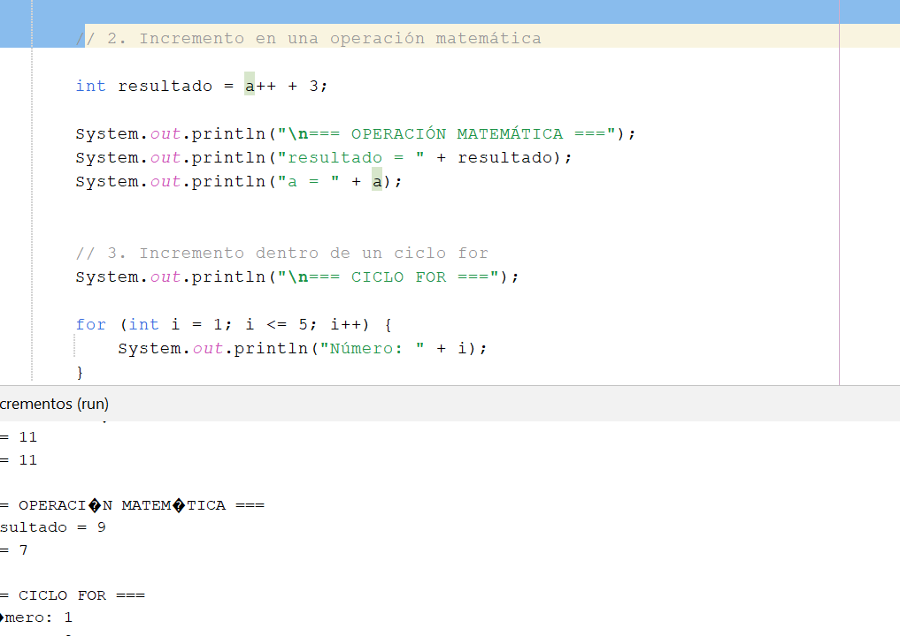
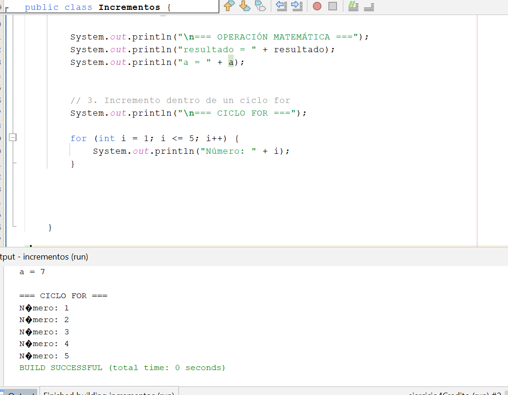
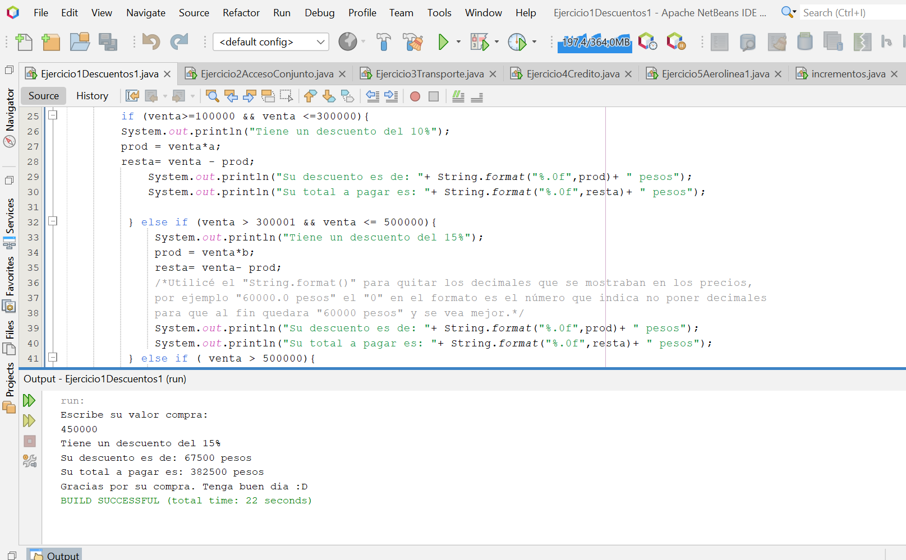
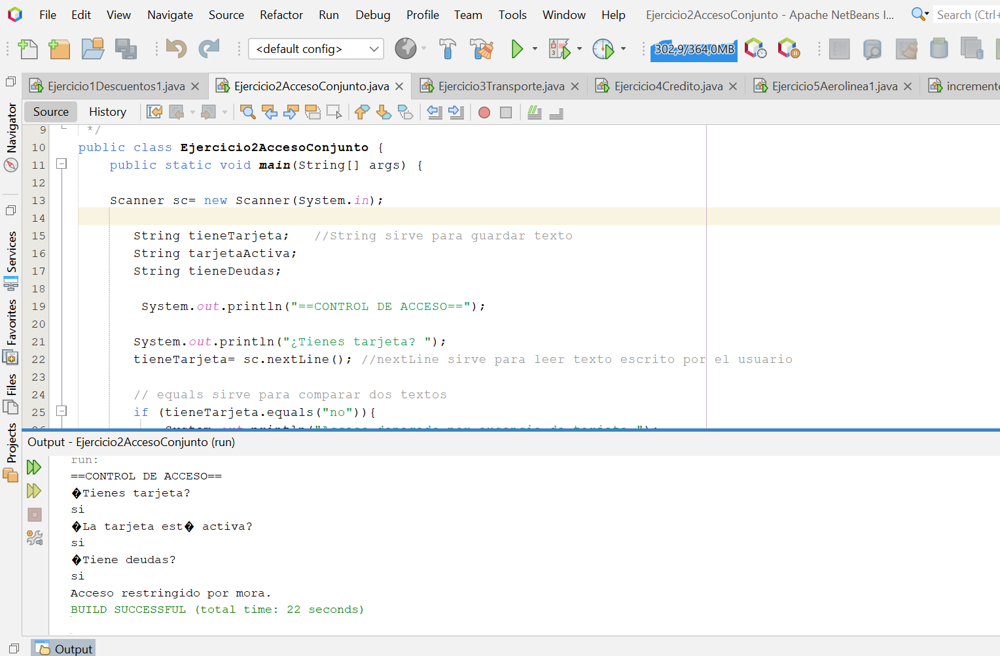
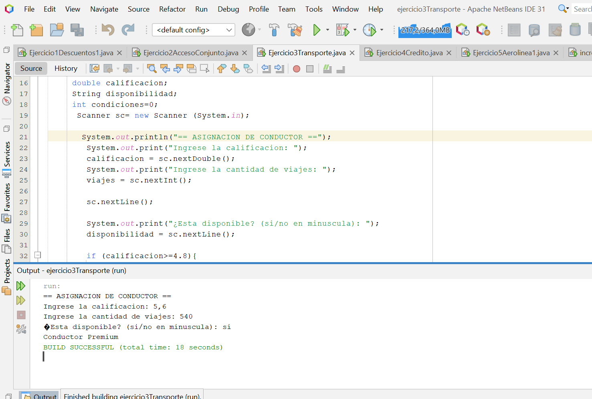
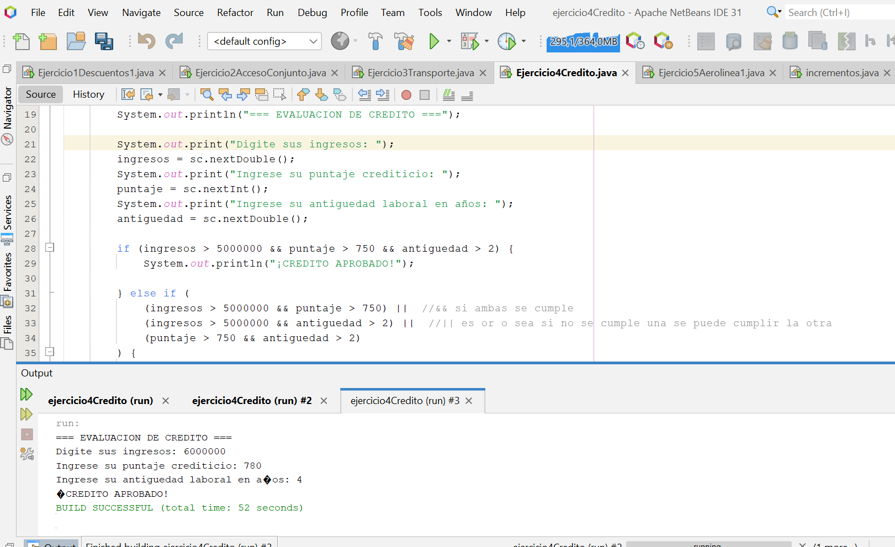
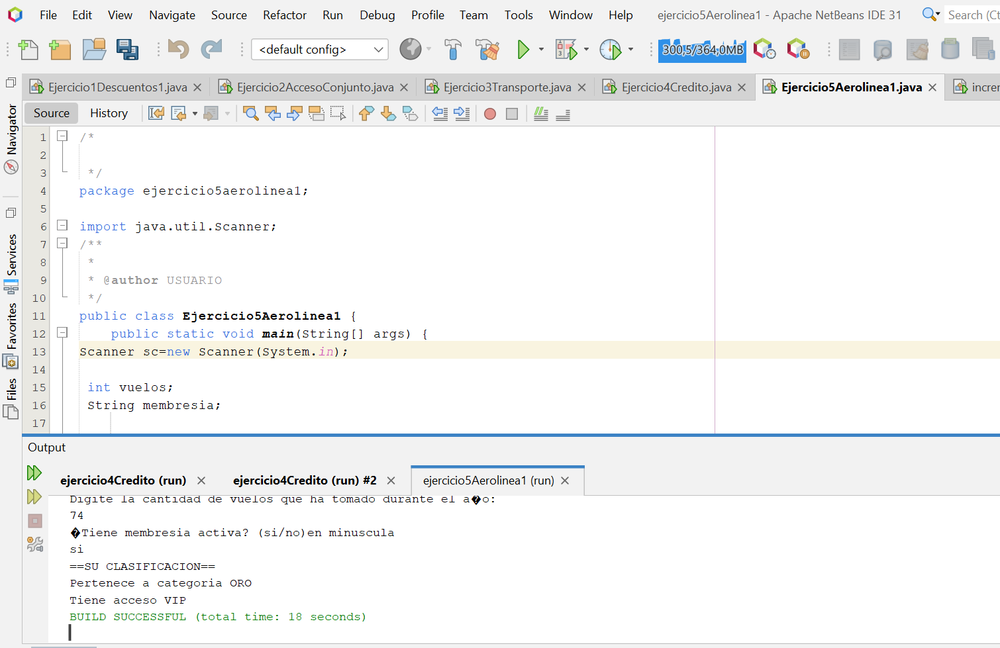

# java-incrementos-y-condicionales
Trabajo de POO
# Taller 1: Operadores de Incremento e Instrucciones condicionales en Java
## 1. Mi informacion
* **Nombre Completo:** Lizeth Mariana Cotrino Ossa
* **Programa Académico:** Tecnologiaa en Desarrollo de Software
* **Fecha de Entrega** 27 de Agosto de 2026
---
## 2. Objetivo de la Actividad

Aplicar los conceptos de preincremento (`++variable`), posincremento (`variable++`) y las diferentes estructuras condicionales de Java mediante ejercicios prácticos.

## 3.Conceptos breves

#### 1. ¿Qué es un operador de incremento?
Un operador de incremento es aquel que permite aumentar el valor de una variable en 1. En Java se representa con ++. Por ejemplo, si tenemos int numero = 5; y escribimos numero++;, el valor de numero aumentará de 5 a 6.

#### 2. ¿Qué diferencia existe entre preincremento y posincremento?
La diferencia entre preincremento y posincremento está en el momento en que se realiza el aumento. El preincremento (++numero) aumenta primero el valor de la variable y después utiliza ese nuevo valor. Por ejemplo, si numero = 5 y escribimos int resultado = ++numero;, primero numero pasa a 6 y luego resultado recibe el valor 6.

En cambio, el posincremento (numero++) utiliza primero el valor actual de la variable y después lo aumenta. Por ejemplo, si numero = 5 y escribimos int resultado = numero++;, resultado recibe primero el valor 5 y después numero aumenta a 6.

#### 3. ¿En qué situaciones producen resultados distintos?
El preincremento y el posincremento producen resultados distintos cuando se utilizan dentro de una expresión o asignación, porque el momento del incremento cambia el valor que se utiliza. Por ejemplo, con ++x, si x vale 10, se utiliza 11; mientras que con x++, primero se utiliza 10 y después x pasa a valer 11. Por eso, la forma fácil de recordarlo es: preincremento = primero aumenta, posincremento = primero utiliza el valor.

#### 4. Estructuras condicionales
Las estructuras condicionales en Java permiten que un programa tome decisiones dependiendo de si una condición se cumple o no.

La estructura if se utiliza para ejecutar una instrucción cuando una condición es verdadera. Por ejemplo, si una persona tiene más de 18 años, se puede mostrar un mensaje indicando que es mayor de edad.

La estructura if - else permite elegir entre dos opciones: si la condición se cumple se ejecuta el if, y si no se cumple se ejecuta el else. Por ejemplo, si una nota es mayor o igual a 3, se muestra “Aprobado”; de lo contrario, “Reprobado”.

La estructura if - else if - else permite evaluar varias condiciones. Por ejemplo, se puede clasificar una nota como “Excelente”, “Bueno” o “Insuficiente” dependiendo de su valor.

Los if anidados son un if dentro de otro if. Se utilizan cuando una decisión depende de que primero se cumpla otra condición. Por ejemplo, primero comprobar si una persona es mayor de edad y después verificar si tiene una identificación.

### Tabla Comparativa de Resultados (`Incrementos.java`)

| Caso          | Valor inicial | Operador | Valor final de la variable | Valor asignado |
| ------------- | ------------: | -------- | -------------------------: | -------------: |
| Preincremento |         a = 5 | `++a`    |                      a = 6 |          b = 6 |
| Posincremento |         c = 5 | `c++`    |                      c = 6 |          d = 5 |

Cuando se ejecuta
a = 6
b = 6
c = 6
d = 5

## Evidencias de los ejemplos adicionales

### 3. Conclusiones Sustentadas

* **Verificación de la premisa:** La afirmación del desarrollador junior es **falsa**. Aunque ambos operadores le suman 1 a la variable en la memoria, no producen el mismo resultado cuando se usan dentro de asignaciones u operaciones compuestas.
* **Evidencia en la ejecución:** En las pruebas realizadas con valor inicial de 5, la salida de la consola confirmó la diferencia de tiempos:
  * `b = 6` con `b = ++a`: El preincremento sumó 1 a la variable **antes** de guardar el valor en `b`.
  * `d = 5` con `d = c++`: El posincremento entregó el valor original a `d` y **después** realizó la suma en memoria.
---

## Parte 2. Programación con IF

### Ejercicio 1. Sistema de Descuentos para un Supermercado

### Ejercicio 2. Acceso a un Conjunto

### Ejercicio 3. Plataforma de Transporte

### Ejercicio 4. Crédito Bancario

### Ejercicio 5. Sistema de viajes de una Aerolínea

### Parte 3. Explicación de los resultados

**Ejercicio 1: Descuentos en el Supermercado**
El ejercicio consiste en calcular el descuento de una compra según su valor. El programa recibe el precio ingresado por el usuario y utiliza if, else if y else para determinar si aplica un descuento del 10%, 15% o 20%. Al recibir el valor de la compra por parte del usuario se determina que % aplica, se multiplica el valor de compra por el porcentaje en decimal y al final se resta el valor de la compra con el producto de la operación anterior para así dar cuanto debe pagar en total el cliente. También se utiliza String.format("%.0f", ...) para mostrar los valores sin decimales y que aparezcan como cantidades enteras de pesos.

**Ejercicio 2: Acceso a Conjunto Residencial**
El ejercicio consiste en controlar el acceso a un conjunto según tres condiciones: tener tarjeta, que esté activa y no tener deudas. El programa utiliza if anidados para revisar cada condición y determinar si el acceso es permitido o restringido. Si se cumple las 3 condiciones su acceso es permitido si no se cumple alguna de las 3 condiciones no puede acceder.También utiliza String para guardar respuestas de texto, nextLine() para leerlas y equals() para compararlas.

**Ejercicio 3: Asignación de Conductor**
El ejercicio consiste en asignar una categoría a un conductor dependiendo de si cumple ciertas condiciones. El programa solicita la calificación, la cantidad de viajes realizados y si el conductor está disponible. Si el usuario cumple con las 3 condiciones es conductor premium, si cumple 2 es conductor estandar sino entonces no puede ser asigando, mediante if, else if y else y la variable condiciones aumenta en 1.

**Ejercicio 4: Crédito Bancario**
El ejercicio consiste en evaluar si una persona puede recibir un crédito dependiendo de sus ingresos, puntaje crediticio y antigüedad laboral. Utilicé if, else if y else junto con los operadores lógicos && (AND) para si cumple las 3 condiciones para recibir su crédito y || (OR) para ver si cumple 2 condiciones para un crédito condicionado pero si no cumple ninguno se lleva su crédito. 

**Ejercicio 5: Sistema de Aerolínea**
El ejercicio consiste en clasificar a los pasajeros de una aerolínea según la cantidad de vuelos que han realizado durante el año y si tienen una membresía activa. Para realizar estas clasificaciones utilicé if anidados y operadores lógicos como &&, que permite comprobar que varias condiciones se cumplan al mismo tiempo. Se pregunta al usuario cuantos vuelos ha tomado durante el año si está entre 51 y 70 su categoría ORO pero no tiene acceso VIP (en el código me aseguré que se muestre si o no tiene acceso VIP) pero si es mayor a 70 tiene acceso VIP,  i sus vuelos está entre 21 y 50 es categoría PLATA sin acceso VIP, si tiene menos vuelos será categoría BÁSICA y menos tendrá acceso VIP.

### 4. Conclusiones

**1. ¿Cuál es la principal diferencia entre ++variable y variable++?**
La diferencia principal entre ambos operadores radica en el momento exacto en el que se realiza el incremento dentro de una instrucción o evaluación de código. Aunque ambos suman una unidad a la variable original, la forma en que el programa procesa la orden cambia por completo el valor que se utiliza en la expresión donde aparecen.

En el caso del pre-incremento (++variable), el sistema modifica el valor de la variable antes de realizar cualquier otra acción. Primero le suma uno al dato almacenado y, de manera inmediata, utiliza ese nuevo valor para la operación actual, como una asignación o una comparación. Por esta razón, si guardas el resultado en otra variable, ambas terminarán teniendo la cifra ya actualizada.

Por el contrario, el post-incremento (variable++) prioriza el valor original. El programa lee la cifra actual, la entrega para que se use en la línea de código presente y solo después de haber terminado esa tarea realiza la suma de una unidad. De este modo, si asignas este resultado a una nueva variable, esta conservará el valor antiguo mientras que la variable inicial cambiará a su valor incrementado.

**2. ¿Qué estructura if considera más adecuada para situaciones complejas y por qué?**
Me parece que la estructura if anidada es adecuada para situaciones complejas porque permite evaluar varias condiciones de manera ordenada, donde una condición depende de que otra se cumpla primero

**3. ¿Qué dificultades encontró durante el desarrollo?**
Hubo una situación en el ejercicio 3 o 4 donde utilizaba las condiciones+1 donde no me aceptaba una condición ya que con el "equals()" si el usuario no escribía lo mismo que estaba en el parentesis no me lo tomaba hasta que tuve que especificar en como debía escribirlo, también me enredaba con las llaves de los if-else if-else y con como se organizaban ya que en algunos casos ponía la condición en otro lugar al que yo requería y por eso no me daba los resultados solicitados.

**4. ¿Qué aprendizajes obtuvo durante la actividad?**
Ahora sé como ubicar los if-else if-else, supe que significaban algunas variables como equals, String, Operadores lógicos entre otros, además ya podría hacer algo sencillos con condicionales sabiendo su estructura y como ubicarla.
